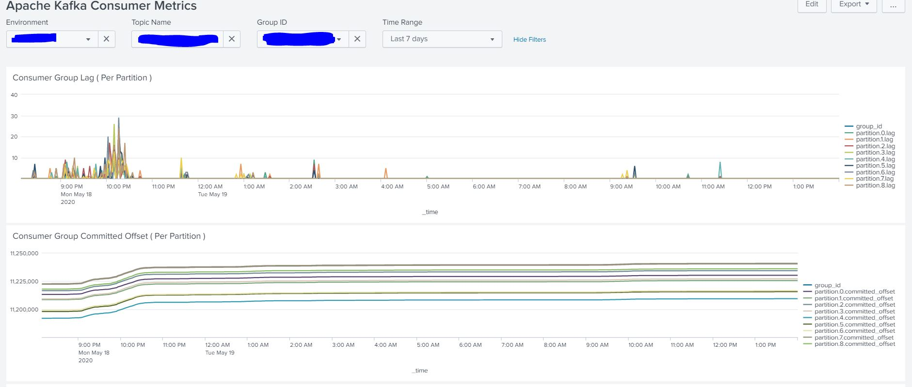

**This repo is not required as latest code for it will be maintained in https://github.com/116davinder/kafka-cluster-ansible/blob/master/roles/jmxMonitor/tasks/kafka-consumer-group-metric.yml**

# apache-kafka-consumer-group-metric-collector
It will collect metric about given consumer groups and reports latest_offset, committed_offset, and lag.

## Requirements
* python3
* kafka-python

## How to Run it
`python3 kafka-consumer-group-metric.py sample-input.txt kafka-log-dir/ kafka-cluster-name`

## Sample Output
```
{
	"topic": "topic1",
	"group_id": "group_id1",
	"env": "dev-env-kafka",
	"@timestamp": "2020-05-18 15:36:01.191032",
	"partition": {
		"0": {
			"committed_offset": 13626733,
			"latest_offset": 13626733,
			"lag": 0
		},
		"1": {
			"committed_offset": 13623397,
			"latest_offset": 13623397,
			"lag": 0
		},
		"2": {
			"committed_offset": 13615804,
			"latest_offset": 13615804,
			"lag": 0
		}
	}
}
....
```

## Sample Dashboard

